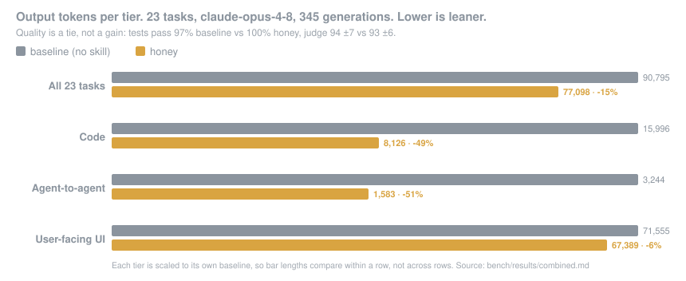

<p align="center">
  
</p>

<h1 align="center">Honey for Claude</h1>

<p align="center">
  <em>Write less code. Say less about it.</em>
</p>

<p align="center">
  
  
  
  
  
  
</p>

<p align="center">
  <strong>−15% output tokens overall &middot; −49% on code &middot; −51% on agent handoffs &middot; quality a tie</strong><br>
  <sub>23 tasks, <code>claude-opus-4-8</code>, 345 generations, against the same agent with no skill. Quality is explicitly <em>not</em> claimed as a gain: tests pass 97% → 100%, judge 94 ±7 → 93 ±6. Benchmarks are <a href="https://github.com/Green-PT/honey-for-devs">upstream's</a>, reproduced here unmodified. <a href="bench/results/combined.md">Full results</a> &middot; <a href="bench/METHODOLOGY.md">method</a>.</sub>
</p>

<p align="center">
  <a href="#install">Install</a> &middot;
  <a href="#what-runs-where">What runs where</a> &middot;
  <a href="#the-14-skills">Skills</a> &middot;
  <a href="#eson">ESON</a> &middot;
  <a href="#numbers">Numbers</a> &middot;
  <a href="#faq">FAQ</a> &middot;
  <a href="#how-this-differs-from-upstream">Differences</a>
</p>

---

> **What this repo is.** [Honey (I Shrunk the AI)](https://github.com/Green-PT/honey-for-devs)
> by [Green-PT](https://github.com/Green-PT), repackaged so it installs as a marketplace in
> the **Claude app** — web, desktop, mobile and Cowork. Skill content is unchanged: 14/14
> skill bodies and 3/3 agent bodies are byte-identical to upstream.
>
> **Using Claude Code in a terminal?** [Install upstream instead.](https://github.com/Green-PT/honey-for-devs)
> It works there and supports a dozen other agents besides.

Upstream doesn't install in the app. The app reads `.agents/plugins/marketplace.json`, and
upstream's copy points at a directory holding only the Codex build — no plugin manifest, no
agents, no hooks. This repo fixes the packaging and nothing else.

---

## Why

Agents are paid by the token, and most tokens are waste. Not wrong output — *surplus*
output. A helper class where a one-liner would do. Three paragraphs explaining code that
reads fine on its own. A tool result pasted in full when a summary and a hash would carry
the same meaning.

Honey attacks that surplus on three independent levers:

1. **Less code.** Walk the ladder, stop at the first rung that holds — does it need to
   exist → is it already in the repo → stdlib → language native → existing dependency →
   one line → minimum block.
2. **Less prose.** No wind-up, no hedging, no narrating code that already reads clearly.
   Answer first.
3. **Denser agent-to-agent handoffs.** When the reader is a program, hand it the most
   token-efficient format it parses losslessly.

It isn't a mode you invoke. It's a writing style the agent applies reflexively, so it costs
no reasoning tokens to decide whether to apply it.

**Never simplified away:** input validation, error handling, auth, secrets, migrations,
deletes, accessibility, and anything you explicitly asked for. Lazy ≠ broken.

Intensity: `lite` keeps the explanation, `full` is the default, `ultra` is answer-only.

---

## Before / after

You ask for a debounce helper. Your agent writes a class, adds a config object, wires up
cancel/flush methods, and explains the event loop.

With Honey:

```js
// honey: setTimeout is the debounce
const debounce = (fn, ms) => (...a) => (clearTimeout(fn.t), fn.t = setTimeout(() => fn(...a), ms));
```

One line, one `honey:` marker naming the shortcut, no essay attached.

---

## Install

**Settings → Plugins → `+` → Add marketplace**

```
S1lverElixir/honey-for-claude
```

Then **Sync → Install**.

Verify: type `/` in a chat. Fourteen `honey-*` commands should appear.

<details>
<summary><strong>It didn't install — what now?</strong></summary>

<br>

**"Marketplace sync failed. Check the repository URL and try again."**
The app caches marketplaces by name. If you already added one called `honey`, remove it
first (⋮ → **Remove**), then add this repo again.

**Commands don't appear after installing.**
The version deliberately tracks upstream (`1.3.1`) rather than bumping on every change, so
the app may serve a cached copy. Force it: **Settings → Plugins → Honey → ⋮ → Update**.

**Subagents and hooks are greyed out.**
Expected in plain chat — see [What runs where](#what-runs-where). They need Cowork.

**`/honey-eco` or `/honey-gain` says a file is missing.**
Both shell out to committed scripts, so they need Cowork. In plain chat they have nothing
to run.

</details>

---

## What runs where

| | Chat — web, desktop, mobile | Cowork |
|---|:---:|:---:|
| 14 skills | ✅ | ✅ |
| 3 subagents | — | ✅ |
| 3 hooks | — | ✅ |

Hooks and subagents grey out in plain chat. That's an Anthropic platform limit, not a
packaging bug. Every skill works everywhere, including the full `honey` core.

---

## The 14 skills

### Core

| Command | What it does |
|---|---|
| `/honey` | The three levers. YAGNI and stdlib-first for code, terse prose for everything else |
| `/honey-chat` | The prose core with no tool dependencies — paste into a Claude Style or Project instructions |

### Code

| Command | What it does |
|---|---|
| `/honey-review` | Reviews a diff for what Honey would cut: speculative generality, hand-rolled stdlib, single-caller abstractions, dead code |
| `/honey-debt` | Harvests every `honey:` comment into a ledger, so deliberate shortcuts get tracked instead of quietly going permanent |
| `/honey-design` | Same pixels, fewer tokens. For landing pages and UI where polish *is* the spec — trims how the design is written, never how it looks |
| `/honey-memory` | Sets up a committed `PROJECT.md` so agents stop rediscovering the same facts every cold session |
| `/honey-compress` | Rewrites `CLAUDE.md`-style context files tersely, cutting input tokens every session |

### Bulk data

| Command | What it does |
|---|---|
| `/honey-ccr` | Compress-Cache-Retrieve for huge repetitive arrays — logs, scans, time series. Keeps an informative sample, caches the rest behind a retrievable hash |
| `/honey-px` | Reads dense read-only text as rendered PNG pages; image tokens scale with pixels, not characters. Lossy on exact strings — never for files you'll edit |
| `/honey-loop` | Cost discipline for recurring `/loop` runs, where waste multiplies by iteration count |

### Orchestration and reporting

| Command | What it does |
|---|---|
| `/honey-hive` | When to delegate to read-only subagents instead of working inline |
| `/honey-superpowers` | Stacks Honey onto Superpowers-style workflows so dispatched subagents inherit the levers |
| `/honey-gain` | Reports the committed benchmark scoreboard from `bench/` |
| `/honey-eco` | Session output tokens and CO₂ via the committed EcoLogits port |

`/honey-gain` and `/honey-eco` run committed scripts, so they need Cowork.

---

## Numbers

<p align="center">
  
</p>

| Variant | Tests pass | Judge ±sd | Output tokens |
|---|---|---|---|
| baseline | 97% | 94 ±7 | 90,795 |
| **honey** | **100%** | 93 ±6 | **77,098 · −15%** |

The tier split *is* the finding. Honey cuts deepest where output is pure code
(**−49%**) and where the reader is another agent (**−51%**); on user-facing UI, where
polish is the spec, it deliberately barely cuts at all (−6%).

The authors' own caveat, kept here: **quality is a tie, not a gain.** Token savings are
real; a quality improvement is not claimed. Every figure is a paired per-task median with a
p-value, and `(ns)` results are ties, not wins.

Source: [`bench/results/combined.md`](bench/results/combined.md) ·
Method: [`bench/METHODOLOGY.md`](bench/METHODOLOGY.md) ·
Reproduce: `cd bench && node src/report.js --stamp full-opus48 --by-type`

---

## ESON

A wire format for agent-to-agent payloads. Repeated record keys are emitted once, declared
row counts catch truncated messages, JSON-compatible cells keep their types.

Measured against compact JSON across five handoff documents, `o200k` tokenizer:

| Format | Valid JSON? | vs compact JSON |
|---|:--:|---:|
| JSON (pretty) — the unprompted default | yes | **+55%** |
| JSON (compact) | yes | 0% |
| TOON | no | −20% |
| JSON (columnar) | yes | −22% |
| **ESON** | no | **−28%** |

Comprehension ties JSON at 100% on key-lookup, column-match, nested-cell and nested-array
access. Positional access and in-context counting fail across *all* formats — a model
limit, not ESON's. Aggregate in code; address records by key.

Spec: [`eso/SPEC.md`](eso/SPEC.md) · Codec: [`eso/index.js`](eso/index.js) ·
Verdict: [`bench/eso/VERDICT.md`](bench/eso/VERDICT.md) ·
CLI: `node bin/eso.js encode|decode|crush`

**CCR** ([`eso/ccr.js`](eso/ccr.js)) covers the other case: arrays too big to read, too
uniform to matter. Keeps endpoints, anomalies and head/tail, drops the redundant middle to
a local cache, leaves a hash you can expand.

---

## Subagents and hooks

Cowork only.

| Subagent | Role |
|---|---|
| `hive-scout` | Read-only code locator. Returns a map of hits, not a tour |
| `hive-reviewer` | Reviews a diff, returns id-keyed findings as data, not a write-up |
| `hive-builder` | Surgical change, max 2 files, returns a change-manifest |

| Hook | Fires |
|---|---|
| `SessionStart` | Re-activates Honey each session until you switch it off |
| `SubagentStart` | Injects the Honey directive into every spawned subagent |
| `PostToolUse` | Compresses bulky Bash output before it reaches context |

### Carbon badge

[`hooks/statusline.js`](hooks/statusline.js) renders a live badge:

```
🍯 honey:full · 🌿 44g CO₂ (saved ~26g · $0.18)
```

Numbers come from the committed EcoLogits port in [`hooks/eco.js`](hooks/eco.js) — no
network, no API key. The saved figure is a **modelled counterfactual**, not a measurement,
and it always carries the bench stamp it came from:

```console
$ node scripts/eco-session.js
output tok : 2,300
CO2eq      : 50.56 g  (served, usage + embodied, JS port)
saved      : ~20.25 g CO2eq  (assumes 29% fewer output tokens than a no-Honey run)
  basis    : modeled from bench/results/full-opus48 — not measured for this session
```

`/honey-eco` expands that into a full breakdown.

### honey-usage

[`bin/usage.js`](bin/usage.js) reads the session data your coding agents already write to
disk and reports **actual** token usage — tokens, approximate USD, served CO₂ — per app and
model. Zero dependencies, no network, nothing leaves your machine.

| App | Source |
|---|---|
| `claude` (Claude Code) | `$CLAUDE_CONFIG_DIR` or `~/.claude` — `projects/**/*.jsonl` |
| `codex` (Codex CLI) | `$CODEX_HOME` or `~/.codex` — `sessions/**/*.jsonl` |
| `opencode` | `($XDG_DATA_HOME` or `~/.local/share)/opencode/opencode.db` |

---

## Input precompression

The three levers cut **output**. There is symmetric waste on the **input** side — filler,
pleasantries, sentences the prompt repeats to itself.

[`hooks/precompress.js`](hooks/precompress.js) is a deterministic, **no-model** compressor
that strips them before the prompt reaches the LLM. Code, paths, URLs, double-quoted
strings and numbers pass through verbatim — it never touches a token you'd need exact.

Upstream keeps this as a **measured negative result**, and so do I. On a hand-written
verbose corpus it cuts −16.5% median. On **266 real prompts from 35 actual sessions** it
cuts 2.5% total, median 0% — 219 of those 266 compress to nothing, because real prompts are
already terse. Deterministic compression can't catch *reworded* restatement; that needs a
model, so this is the ceiling, not a tuning gap.

The honest conclusion from upstream: **the prompt is the wrong target.** Real input volume
in agentic coding is tool output — CCR's domain — and re-pasted context across turns, not
human pleasantries. It ships as a filter you can reach for, never wired always-on.

---

## FAQ

**Do I have to type `/honey` every session?**
No. In Cowork the `SessionStart` hook re-activates your last intensity until you run
`/honey off`. Plain chat has no hooks, so invoke the skill when you want it.

**Can I use it with Caveman, Ponytail or Superpowers?**
Yes - they solve different halves. Ponytail cuts code, Caveman cuts prose, Honey does both
plus agent-to-agent handoffs. `/honey-superpowers` stacks the levers onto Superpowers-style
subagent workflows instead of fighting them.

**Does it make the agent cut corners on security?**
No, and the skill text enforces it. Input validation at trust boundaries, error handling
that prevents data loss, auth and secrets, accessibility basics, and anything you asked for
are listed as never-simplify. In handoffs, auth/money/migrations/deletes stay explicit.

**I only use claude.ai in the browser, no Cowork. Is it worth it?**
Yes - all 14 skills work in plain chat. You lose hooks, subagents, and the two skills that
shell out (`/honey-gain`, `/honey-eco`). For the prose core with no plugin at all, paste
[`skills/honey-chat/SKILL.md`](skills/honey-chat/SKILL.md) into a Project or Style.

**Why does quality say "tie" instead of "better"?**
Because that is what the benchmark shows: judge 94 +/-7 baseline vs 93 +/-6 honey, inside
the noise. Claiming a quality win off that would be dishonest; the win is token volume.

**Is this a fork? Will it drift from upstream?**
Not a fork - a repackage. Skill and agent bodies are byte-identical and the version stays
pinned to upstream's `1.3.1`, so you can always diff the two. Upstream's per-platform rule
generators and their outputs are removed here, since this repo targets one platform.

---

## How this differs from upstream

| | Upstream | Here |
|---|---|---|
| Skills | 14 | 14 — bodies byte-identical |
| Subagents | 3 | 3 — bodies byte-identical |
| Code: hooks, ESON, bin | — | byte-identical |
| Benchmarks (`bench/`) | yes | kept, unmodified |
| Version | 1.3.1 | 1.3.1, kept in sync |
| Cursor · Windsurf · Cline · Kiro · Hermes · OpenClaw · Codex | yes | removed |
| CI workflows, test suite, npm manifest | yes | removed |

Only skill frontmatter changed: characters the Claude.ai marketplace validator rejects —
emoji, `≤`, em dashes — replaced with ASCII. Instruction text untouched.

Want Cursor, Gemini CLI, Hermes or the one-line installer?
[Upstream](https://github.com/Green-PT/honey-for-devs) ships all of it.

---

## License

MIT, same as upstream — Copyright (c) 2026 Green-PT. See [`LICENSE`](LICENSE) and
[`NOTICE`](NOTICE). `hooks/eco-models.json` derives from
[EcoLogits](https://github.com/genai-impact/ecologits) and stays under MPL-2.0.

Every idea, skill and benchmark here is
**[Green-PT](https://github.com/Green-PT)**'s work. This repo only rearranges the packaging.
If Honey earns its place in your setup, star
[the original](https://github.com/Green-PT/honey-for-devs).

The benchmarks compare Honey against
[Ponytail](https://github.com/DietrichGebert/ponytail) and
[Caveman](https://github.com/JuliusBrussee/caveman). Both are worth your time.
